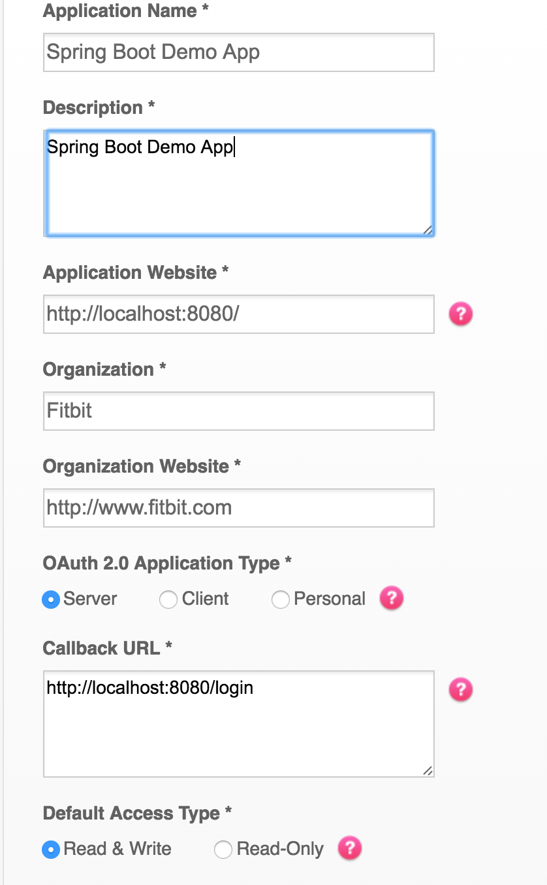

#Fitbit OAuth Spring Boot Demo

This app deals with the boilerplate code of using the Fitbit API with Spring Boot, authenticating via OAuth and making a simple API call. It is meant as a starting point for more robust applications and a demonstration of some of the basic concepts of the API. Java 8 is preferred, though 
 
[Installing a JDK](https://docs.oracle.com/javase/8/docs/technotes/guides/install/install_overview.html)
[Read More About the Fitbit API](https://dev.fitbit.com/docs/)

##Prerequisites
This document assumes you have a JDK and maven installed. A tutorial for installing these is out of scope for this project, but there are many resources to instruct you on how to do so.

[Installing Apache Maven](https://maven.apache.org/install.html)

## Developing Your Own App

First fork this repo

Then create a [Fitbit App Config](https://dev.fitbit.com/apps/new). 

This is the config I used while developing. Your app may not need read/write access.



Once you have setup your app you need to put the client ID and client secret into the application config. You should be able to find both of these on the [manage apps page](https://dev.fitbit.com/apps). These values should be placed in src/main/resources/application.yml. No quotes are required around these values, simply paste them over the placeholders.

```
security:
  oauth2:
    client:
      clientId: YOUR_CLIENT_ID_HERE
      clientSecret: YOUR_CLIENT_SECRET_HERE
      accessTokenUri: https://api.fitbit.com/oauth2/token
      userAuthorizationUri: https://www.fitbit.com/oauth2/authorize
      tokenName: oauth_token
      authenticationScheme: header
      clientAuthenticationScheme: header
      scope: "activity heartrate location nutrition profile settings sleep social weight"
    resource:
      userInfoUri: https://api.fitbit.com/1/user/-/profile.json
fitbit:
  api:
    resource:
      activitiesUri: https://api.fitbit.com/1/user/-/activities.json

logging:
  level:
    org.springframework.security: TRACE
```

You should decide on the OAuth scopes for your project. Specifically, define what data your app will
be accessing from people's Fitbit accounts. These are also defined in application.yml. By default this file requests every scope, but you should remove those you do not need

[Read more about OAuth Scopes](https://dev.fitbit.com/docs/oauth2/)

Once you have saved you changes starting the app is easy. Simply run 
```
mvn spring-boot:run
```

After a moment your app should be started and you can go to [http://localhost:8080](http://localhost:8080) and follow the login flow.

The app as written will only access your fitbit profile to demonstrate OAuth working.